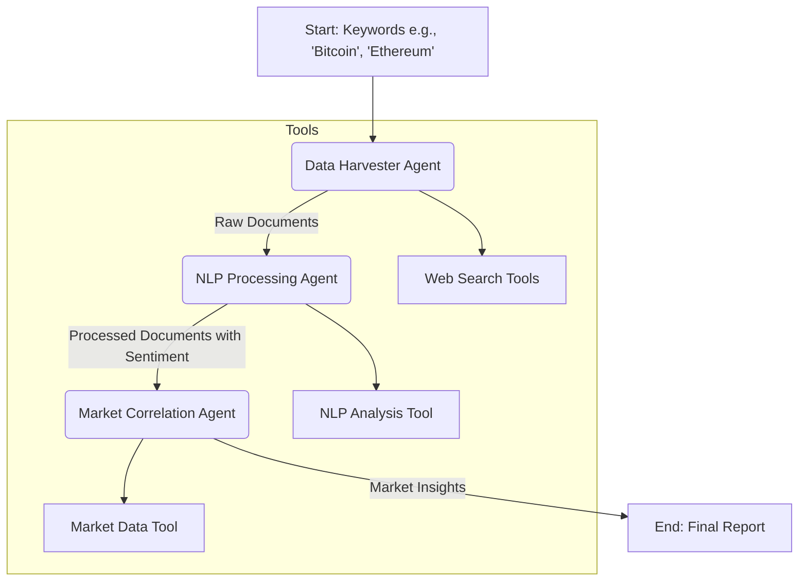

---

# CryptoSentinator 🤖📈

**A Multi-Agent Market Sentiment Analyzer powered by LangGraph**


CryptoSentinator is a proof-of-concept multi-agent system designed to gather, analyze, and correlate cryptocurrency sentiment from various online sources with market data. It leverages the power of LangGraph to orchestrate a team of specialized agents, each with a distinct role, to produce actionable market insights.

This project serves as a comprehensive example of building a stateful, multi-agent workflow using modern AI engineering principles.

## 📋 Table of Contents

- [About The Project](#about-the-project)
- [Key Features](#key-features)
- [System Architecture](#system-architecture)
- [Getting Started](#getting-started)
  - [Prerequisites](#prerequisites)
  - [Installation & Setup](#installation--setup)
- [Usage](#usage)
- [Project Structure](#project-structure)
- [Agents and Their Roles](#agents-and-their-roles)
- [Roadmap](#roadmap)
- [Contributing](#contributing)
- [License](#license)

## 🌟 About The Project

In the volatile world of cryptocurrency, market sentiment on social media and in the news can be a powerful indicator of future price movements. CryptoSentinator automates the process of monitoring this sentiment.

It uses a team of three AI agents:

1.  **Data Harvester:** Scans mock social media (X, Reddit) and news sources for mentions of specific cryptocurrencies.
2.  **NLP Processor:** Uses a Large Language Model (LLM) to perform nuanced sentiment analysis and entity extraction on the gathered data.
3.  **Market Correlator:** Aggregates sentiment scores, fetches mock price data, and generates high-level insights on the potential correlation between public opinion and market behavior.

The entire workflow is orchestrated by **LangGraph**, which manages the state and ensures seamless data flow between the agents.

## ✨ Key Features

-   **Multi-Agent Architecture:** Demonstrates a clear separation of concerns with specialized agents for data gathering, processing, and analysis.
-   **LangGraph Orchestration:** Utilizes a stateful graph to manage the complex workflow, making the system robust and easy to debug.
-   **Extensible Toolset:** Integrates multiple custom tools for web searching (mock), NLP analysis, and market data retrieval (mock).
-   **LLM-Powered NLP:** Leverages the power of models like GPT-3.5-turbo for sophisticated sentiment analysis beyond simple keyword matching.
-   **Modular Design:** The project structure is organized into logical components (agents, tools, config), making it easy to extend or modify.

## 🏗️ System Architecture

The project operates as a stateful graph where each agent acts as a node. The `GraphState` object is passed and updated at each step, ensuring a shared understanding of the task's progress.

The flow is linear and can be visualized as follows:



1.  **Input**: The system is initialized with a list of target keywords (e.g., `["Bitcoin", "Ethereum"]`).
2.  **Data Harvester**: This agent calls its tools to gather mock posts and articles related to the keywords. It updates the state with a list of `RawDocument`.
3.  **NLP Processor**: This agent takes the `RawDocument` list, runs each document through an LLM-based NLP tool to determine sentiment and extract entities, and updates the state with a list of `ProcessedDocument`.
4.  **Market Correlator**: This final agent aggregates the sentiment data, fetches mock market prices, and generates `MarketInsight` objects, which form the final output.

## 🚀 Getting Started

Follow these instructions to get a local copy up and running.

### Prerequisites

-   Python 3.9+
-   An API Key

### Installation & Setup

1.  **Clone the repository:**
    ```sh
    git clone https://github.com/your-username/cryptosentinator.git
    cd cryptosentinator
    ```

2.  **Create and activate a virtual environment:**
    ```sh
    # For macOS/Linux
    python3 -m venv .venv
    source .venv/bin/activate

    # For Windows
    python -m venv .venv
    .\.venv\Scripts\activate
    ```

3.  **Install the required dependencies:**
    ```sh
    pip install -r requirements.txt
    ```

4.  **Set up your API Key:**
    Create a file named `.env` inside the `cryptosentinator/` directory and add your API key:
    ```.env
    GEMINI_API_KEY="sk-YourSecret_ApiKey"
    ```

## 🏃 Usage

To run the system, navigate to the root directory of the project (the one containing the `cryptosentinator` folder) and execute the `main` module.

```sh
python -m cryptosentinator.main
```

The script will start the agent workflow for the default keywords ("Bitcoin", "Ethereum"). You will see a real-time log of the agents and tools at work.

**Example Output:**

```
🚀 Starting CryptoSentinator for keywords: ['Bitcoin', 'Ethereum'] 🚀

--- Current State after node: data_harvester ---
--- TOOL: Mock X Search for 'Bitcoin' ---
--- TOOL: Mock Reddit Search for 'Bitcoin' in r/cryptocurrency ---
...

--- AGENT: NLP Processor Running ---
--- TOOL: LLM NLP for text: 'Great news for #Bitcoin! To the moon!...' ---
...

--- AGENT: Market Correlation Running ---
Correlating for: Bitcoin
--- TOOL: Mock Crypto Price for 'Bitcoin' ---
...

🏁 CryptoSentinator Run Finished 🏁

--- Final Market Insights ---
{ 'correlation_notes': [ 'Strong positive sentiment (0.75) coincides with price '
                         'increase (3.45%). Potential bullish signal for '
                         'Bitcoin.'],
  'cryptocurrency': 'Bitcoin',
  'key_articles_or_posts': [ {'content': 'Great news for #Bitcoin! To the moon! 🚀 '
                                        '#BitcoinIsTheFuture...',
                              'sentiment': 1.0},
                             ...],
  'overall_sentiment_score': 0.75,
  'sentiment_trend': 'Improving'}
...
```

## 📁 Project Structure

The codebase is organized to be modular and easy to navigate.

```
cryptosentinator/
├── __init__.py
├── main.py                     # Main script to run the system
├── agents/
│   ├── __init__.py
│   ├── data_harvester_agent.py
│   ├── nlp_processing_agent.py
│   └── market_correlation_agent.py
├── tools/
│   ├── __init__.py
│   ├── web_search_tools.py     # Mock X, Reddit, NewsAPI tools
│   ├── nlp_tools.py            # Sentiment & Entity Extraction
│   └── market_data_tools.py    # Mock Crypto Price API
├── graph_state.py              # Defines the shared state for LangGraph
├── config.py                   # Loads configuration (e.g., API keys)
└── requirements.txt            # Project dependencies
.env                            # (You create this) Stores secrets
```

## 🤖 Agents and Their Roles

-   `DataHarvesterAgent`: Responsible for gathering information. It uses the `web_search_tools` to simulate fetching data from X, Reddit, and news outlets.
-   `NlpProcessingAgent`: The analytical core. It takes raw text and uses the LLM-powered `nlp_tools` to enrich it with sentiment scores and identified entities.
-   `MarketCorrelationAgent`: The synthesizer. It aggregates all processed data, pulls in mock price information from `market_data_tools`, and generates the final, human-readable insights.

## 🗺️ Roadmap

This project is a foundation. Future enhancements could include:

-   [ ] **Real-time Data Integration:** Replace mock tools with real API clients for X, Reddit, NewsAPI, and a live crypto exchange like Binance or CoinGecko.
-   [ ] **Human-in-the-Loop:** Add a conditional node in the graph for human verification of critical insights before they are finalized.
-   [ ] **Advanced Correlation Models:** Move beyond simple checks to statistical models (e.g., Granger causality) or time-series analysis to find more robust correlations.
-   [ ] **Formal Evaluation Framework:** Implement a backtesting module to evaluate the profitability of signals generated by the system against historical data.
-   [ ] **Agent Communication Protocol (MCP):** If scaling to distributed services, define a formal JSON-based messaging schema for agents to communicate over a message queue (e.g., RabbitMQ).

## 🤝 Contributing

Contributions are what make the open-source community such an amazing place to learn, inspire, and create. Any contributions you make are **greatly appreciated**.

Please fork the repo and create a pull request. You can also simply open an issue with the tag "enhancement".

1.  Fork the Project
2.  Create your Feature Branch (`git checkout -b feature/AmazingFeature`)
3.  Commit your Changes (`git commit -m 'Add some AmazingFeature'`)
4.  Push to the Branch (`git push origin feature/AmazingFeature`)
5.  Open a Pull Request

## 📄 License

Distributed under the MIT License. See `LICENSE` for more information.
