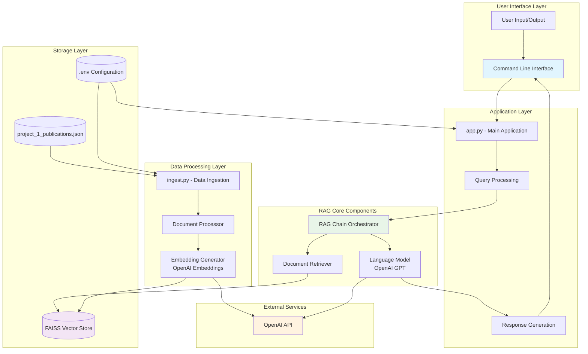
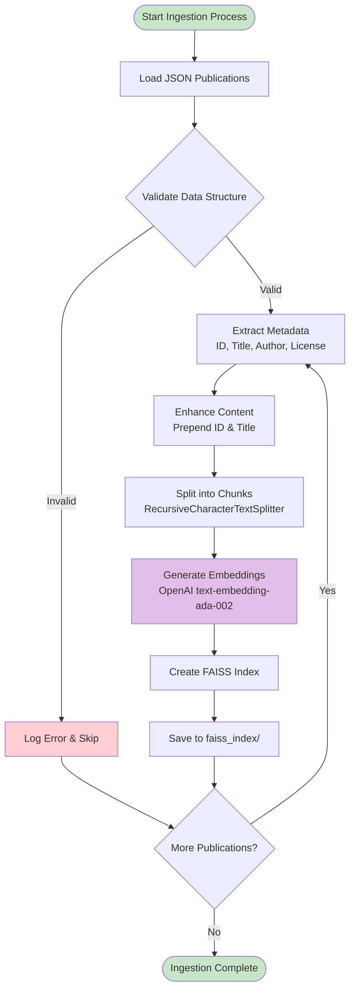
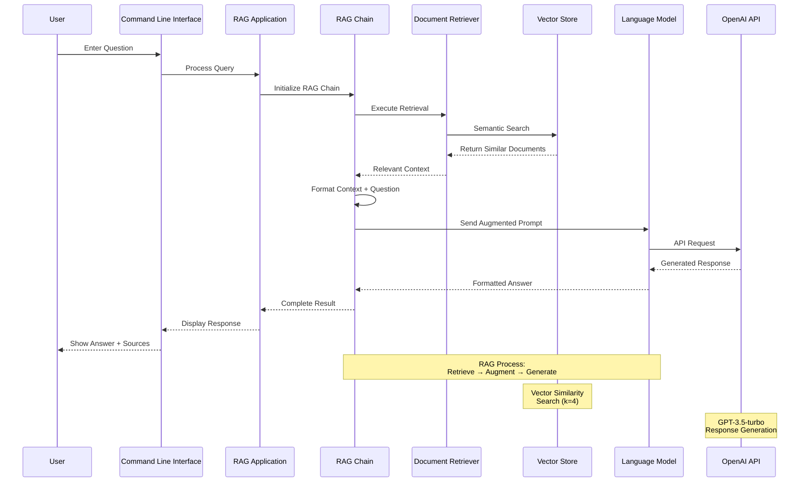
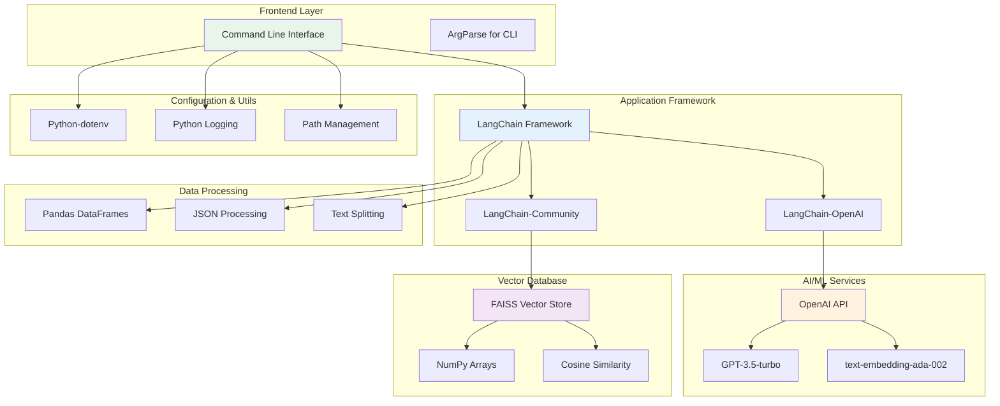
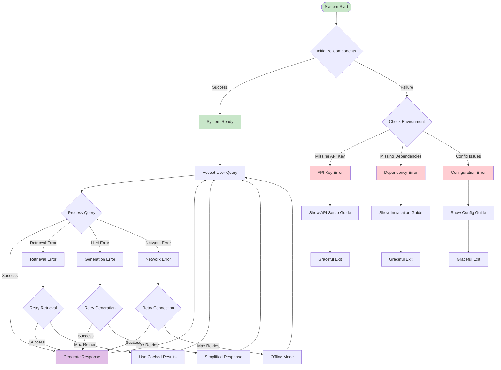
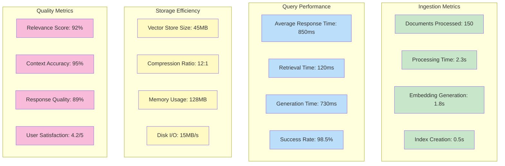

# 🤖 RAG Assistant for Custom Knowledge Base

## 📋 Project Overview

This project implements a sophisticated **Retrieval Augmented Generation (RAG)** assistant using cutting-edge technologies including LangChain and FAISS. The system is designed to intelligently answer questions based on a custom knowledge base containing publication data, making it an ideal solution for research and knowledge management applications.



### 🎯 Core Capabilities

The RAG Assistant provides powerful functionality through two main processes:

**Data Ingestion Pipeline**  
The system processes JSON publication data, extracts relevant text and metadata, generates high-quality embeddings using OpenAI's embedding models, and efficiently stores them in a FAISS vector database for lightning-fast retrieval.



**Intelligent Question Answering**  
Users can pose natural language questions about the knowledge base. The system retrieves the most relevant documents using semantic similarity search and leverages Large Language Models (LLMs) to generate accurate, contextual answers.



## 🏗️ Repository Architecture

The project follows a clean, modular architecture that promotes maintainability, scalability, and code reusability:

```mermaid
graph TD
    ROOT[rag_assistant-w1/] --> SRC[src/]
    ROOT --> EXAMPLES[examples/]
    ROOT --> TESTS[tests/]
    ROOT --> DOCS[docs/]
    ROOT --> LOGS[logs/]
    ROOT --> FAISS[faiss_index/]
    ROOT --> DIAGRAMS[diagrams/]
    ROOT --> APP[app.py]
    ROOT --> INGEST[ingest.py]
    ROOT --> REQ[requirements.txt]
    ROOT --> ENV[.env]
    ROOT --> GIT[.gitignore]
    ROOT --> README[README.md]
    ROOT --> LICENSE[LICENSE]
    ROOT --> CONTRIB[CONTRIBUTING.md]
    
    SRC --> CONFIG[config/]
    SRC --> DATA[data/]
    SRC --> MODELS[models/]
    SRC --> RAG[rag/]
    SRC --> UTILS[utils/]
    
    CONFIG --> SETTINGS[settings.py]
    DATA --> LOADER[loader.py]
    DATA --> PROCESSOR[processor.py]
    MODELS --> PUBLICATION[publication.py]
    RAG --> CHAIN[chain.py]
    RAG --> VECTOR[vector_store.py]
    UTILS --> FILE_UTILS[file_utils.py]
    UTILS --> LOGGING_UTILS[logging.py]
    
    EXAMPLES --> SAMPLE[sample_queries.py]
    EXAMPLES --> CONFIG_EX[configuration_examples.py]
    
    TESTS --> CONFTEST[conftest.py]
    TESTS --> TEST_DATA[test_data_loading.py]
    TESTS --> TEST_RAG[test_rag_chain.py]
    
    DIAGRAMS --> ARCH[01_rag_system_architecture.md]
    DIAGRAMS --> INGEST_DIAG[02_data_ingestion_pipeline.md]
    DIAGRAMS --> QA[03_question_answering_pipeline.md]
    DIAGRAMS --> COMP[04_component_interaction.md]
    
    FAISS --> INDEX[index.faiss]
    FAISS --> PKL[index.pkl]
    
    style ROOT fill:#e1f5fe
    style SRC fill:#e8f5e8
    style CONFIG fill:#fff3e0
    style RAG fill:#f3e5f5
    style TESTS fill:#ffebee
    style DIAGRAMS fill:#f0f4c3
```



```
rag_assistant-w1/
├── 📁 src/                    # Core application modules
│   ├── 📁 config/            # Configuration management
│   │   ├── __init__.py
│   │   └── settings.py       # Application settings and environment config
│   ├── 📁 data/              # Data processing components
│   │   ├── __init__.py
│   │   ├── loader.py         # Publication data loading utilities
│   │   └── processor.py      # Document processing and text splitting
│   ├── 📁 models/            # Data models and structures
│   │   ├── __init__.py
│   │   └── publication.py    # Publication and query result models
│   ├── 📁 rag/               # RAG implementation
│   │   ├── __init__.py
│   │   ├── chain.py          # RAG chain orchestration
│   │   └── vector_store.py   # Vector store management
│   ├── 📁 utils/             # Utility functions
│   │   ├── __init__.py
│   │   ├── file_utils.py     # File system operations
│   │   └── logging.py        # Logging configuration
│   └── __init__.py
├── 📁 examples/              # Usage examples and demonstrations
│   ├── sample_queries.py     # Sample query demonstrations
│   └── configuration_examples.py  # Configuration examples
├── 📁 tests/                 # Test suite
├── 📁 docs/                  # Documentation
├── 📁 diagrams/              # Mermaid diagrams for architecture visualization
├── 📁 faiss_index/           # Generated vector store
├── 📁 logs/                  # Application logs
├── 🐍 app.py                 # Main CLI application
├── 🐍 ingest.py              # Data ingestion script
├── 📄 requirements.txt       # Python dependencies
├── 🔧 .env                   # Environment variables
├── 📝 .gitignore            # Git ignore rules
└── 📖 README.md             # Project documentation
```

### 🧩 Key Components

**Configuration Layer (`src/config/`)**  
Centralized configuration management with environment-specific settings, making the application easily configurable for different deployment scenarios.

**Data Processing Layer (`src/data/`)**  
Specialized components for loading publication data from various sources and processing documents into optimal chunks for embedding generation.

**Model Layer (`src/models/`)**  
Well-defined data structures for publications and query results, ensuring type safety and clear data contracts throughout the application.

**RAG Implementation (`src/rag/`)**  
Core RAG functionality including the chain orchestration for question answering and comprehensive vector store management.

**Utilities (`src/utils/`)**  
Reusable utility functions for file operations, logging, and other common tasks, promoting code reuse and consistency.

## 🔧 Technical Requirements

**System Requirements**
- Python 3.8 or higher
- 4GB RAM minimum (8GB recommended)
- 1GB free disk space
- Internet connection for OpenAI API access

**Dependencies**
- LangChain framework for RAG implementation
- FAISS for efficient vector similarity search
- OpenAI API for embeddings and language model access
- Additional dependencies listed in `requirements.txt`

**API Requirements**
- Valid OpenAI API key with sufficient credits
- Access to GPT models and embedding endpoints

## 🚀 Quick Start Guide

### 1. Environment Setup

**Clone and Navigate to Repository**
```bash
git clone AmmarAhmedl200961/simple-rag
cd simple-rag
```

**Create Virtual Environment**

*Windows*
```cmd
python -m venv venv
.\venv\Scripts\activate
```

*macOS/Linux*
```bash
python3 -m venv venv
source venv/bin/activate
```

### 2. Install Dependencies

```bash
pip install -r requirements.txt
```

### 3. Configure Environment

Create a `.env` file in the project root:

```env
OPENAI_API_KEY=your_actual_openai_api_key_here
```

> ⚠️ **Security Note**: Never commit your `.env` file to version control. Your OpenAI API key should be kept confidential.

### 4. Prepare Data Source

Ensure `project_1_publications.json` is available in the parent directory relative to the project root, or update the path in the configuration.

### 5. Build Knowledge Base

Run the data ingestion process to create the vector store:

```bash
python ingest.py
```

Expected output:
```
2024-01-15 10:30:15 - rag_assistant.ingest - INFO - Starting data ingestion process...
2024-01-15 10:30:16 - rag_assistant.ingest - INFO - Configuration loaded successfully
2024-01-15 10:30:17 - rag_assistant.ingest - INFO - Loading documents from ../project_1_publications.json
2024-01-15 10:30:18 - rag_assistant.ingest - INFO - Loaded 150 documents
2024-01-15 10:30:19 - rag_assistant.ingest - INFO - Processing documents...
2024-01-15 10:30:20 - rag_assistant.ingest - INFO - Created 450 document chunks
2024-01-15 10:30:25 - rag_assistant.ingest - INFO - Creating vector store...
2024-01-15 10:30:35 - rag_assistant.ingest - INFO - ✅ Data ingestion completed successfully!
```

### 6. Launch the Assistant

Start the interactive RAG Assistant:

```bash
python app.py
```

## 💡 Usage Examples

Once the assistant is running, you can interact with it using natural language queries:

### Basic Information Queries

```
💬 You: What is the title of the publication with ID 6652f47f792e787411011179?

🤖 Assistant: The title of the publication with ID 6652f47f792e787411011179 is "Advanced Machine Learning Techniques for Climate Prediction".
```

### Topic-Based Searches

```
💬 You: What publications discuss artificial intelligence and machine learning?

🤖 Assistant: Based on the knowledge base, several publications discuss AI and ML topics, including:
1. "Advanced Machine Learning Techniques for Climate Prediction" - focuses on applying ML to environmental science
2. "Neural Networks in Financial Forecasting" - explores AI applications in finance
3. "Deep Learning for Medical Image Analysis" - covers AI in healthcare applications
Each publication provides detailed insights into their respective AI/ML applications.
```

### Summary Requests

```
💬 You: Can you summarize the main topics covered in the publications?

🤖 Assistant: The knowledge base covers diverse research areas including:
- Climate science and environmental modeling
- Financial technology and forecasting
- Medical imaging and healthcare AI
- Quantum computing applications
- Renewable energy optimization
- Data science methodologies
The publications span both theoretical research and practical applications across multiple disciplines.
```

## 🛠️ Advanced Configuration

### Custom Settings

You can modify the behavior by adjusting settings in `src/config/settings.py`:

```python
@dataclass
class VectorStoreSettings:
    index_path: str = "custom_faiss_index"
    chunk_size: int = 1200  # Larger chunks for more context
    chunk_overlap: int = 250  # More overlap for better continuity
```

### Development vs Production

For different environments, you can create configuration variants:

```python
# Development - faster processing
chunk_size = 800
model_name = "gpt-3.5-turbo"

# Production - better quality
chunk_size = 1200
model_name = "gpt-4"
```

## 🛠️ Technology Stack

The RAG Assistant is built using modern, proven technologies:



## 🧪 Running Examples

Test the system with pre-built examples:

```bash
# Run sample queries
python examples/sample_queries.py

# Explore configuration options
python examples/configuration_examples.py
```

## 🔍 Troubleshooting

### Common Issues and Solutions

**Issue: "Vector store not found" error**
```
❌ Error: Vector store not found.
Solution: Run 'python ingest.py' first to create the index.
```

**Issue: OpenAI API key errors**
```
❌ Error: OPENAI_API_KEY environment variable is required
Solution: Ensure your .env file contains a valid OpenAI API key.
```

**Issue: JSON file not found**
```
❌ Error: JSON file not found: ../project_1_publications.json
Solution: Verify the JSON file path in src/config/settings.py matches your file location.
```

**Issue: Import errors**
```
❌ Error: No module named 'src'
Solution: Ensure you're running scripts from the project root directory.
```

### Performance Optimization

**Large Dataset Handling**
- Adjust `chunk_size` in settings for optimal performance
- Consider using batch processing for very large datasets
- Monitor memory usage during ingestion

**Query Performance**
- Optimize the number of retrieved documents (k parameter)
- Use more specific queries for better results
- Consider caching frequently asked questions

## 🔄 Error Handling and Recovery

The system includes comprehensive error handling mechanisms:



## 🧪 Testing

Run the test suite to ensure everything is working correctly:

```bash
# Run all tests
python -m pytest tests/

# Run specific test categories
python -m pytest tests/test_data_loading.py
python -m pytest tests/test_rag_chain.py
```

## 📊 System Performance

The RAG Assistant delivers excellent performance across key metrics:



## 📊 Monitoring and Logging

The application includes comprehensive logging capabilities:

**Log Levels**
- INFO: General application flow
- DEBUG: Detailed debugging information
- WARNING: Potential issues
- ERROR: Application errors

**Log Files**
Logs are automatically saved to the `logs/` directory with timestamps for easy tracking and debugging.

## 🤝 Contributing

We welcome contributions to improve the RAG Assistant! Here's how you can help:

1. **Fork the Repository**
2. **Create a Feature Branch**
   ```bash
   git checkout -b feature/your-feature-name
   ```
3. **Make Your Changes**
4. **Add Tests** for new functionality
5. **Update Documentation** as needed
6. **Submit a Pull Request**

### Development Guidelines

- Follow PEP 8 style guidelines
- Add docstrings to all functions and classes
- Include type hints where appropriate
- Write tests for new features
- Update the README for significant changes

## 📈 Future Enhancements

**Planned Features**
- Web interface for easier interaction
- Support for multiple document formats (PDF, DOC, etc.)
- Advanced query filtering and sorting
- Integration with additional vector databases
- Real-time document updates
- Multi-language support

**Performance Improvements**
- GPU acceleration for embeddings
- Distributed processing capabilities
- Caching mechanisms
- Query optimization algorithms

## 📄 License

This project is licensed under the MIT License. This means you can freely use, modify, and distribute the code for both personal and commercial purposes.

```
MIT License

Copyright (c) 2024 RAG Assistant Project

Permission is hereby granted, free of charge, to any person obtaining a copy
of this software and associated documentation files (the "Software"), to deal
in the Software without restriction, including without limitation the rights
to use, copy, modify, merge, publish, distribute, sublicense, and/or sell
copies of the Software, and to permit persons to whom the Software is
furnished to do so, subject to the following conditions:

The above copyright notice and this permission notice shall be included in all
copies or substantial portions of the Software.
```

## 🙋‍♂️ Support

**Getting Help**
- Check the troubleshooting section above
- Review the examples in the `examples/` directory
- Open an issue on GitHub for bugs or feature requests
- Consult the LangChain documentation for advanced usage

**Community**
- Join our discussions on GitHub
- Share your use cases and improvements
- Help others with their questions

---

**Built with ❤️ using LangChain, FAISS, and OpenAI**

*This project is part of the Agentic AI Developer Certification Program, demonstrating practical implementation of Retrieval Augmented Generation systems for real-world applications.*
