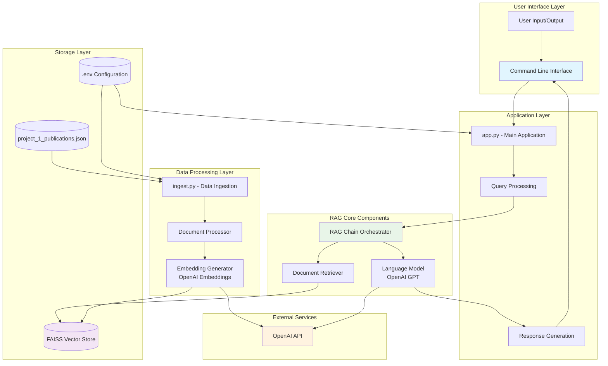

# RAG System Architecture Overview

```mermaid
graph TB
    subgraph "User Interface Layer"
        CLI[Command Line Interface]
        USER[User Input/Output]
    end
    
    subgraph "Application Layer"
        APP[app.py - Main Application]
        QUERY[Query Processing]
        RESPONSE[Response Generation]
    end
    
    subgraph "RAG Core Components"
        RETRIEVER[Document Retriever]
        LLM[Language Model<br/>OpenAI GPT]
        CHAIN[RAG Chain Orchestrator]
    end
    
    subgraph "Data Processing Layer"
        INGEST[ingest.py - Data Ingestion]
        PROCESSOR[Document Processor]
        EMBEDDER[Embedding Generator<br/>OpenAI Embeddings]
    end
    
    subgraph "Storage Layer"
        FAISS[(FAISS Vector Store)]
        JSON[(project_1_publications.json)]
        CONFIG[(.env Configuration)]
    end
    
    subgraph "External Services"
        OPENAI[OpenAI API]
    end
    
    USER --> CLI
    CLI --> APP
    APP --> QUERY
    QUERY --> CHAIN
    CHAIN --> RETRIEVER
    CHAIN --> LLM
    RETRIEVER --> FAISS
    LLM --> RESPONSE
    RESPONSE --> CLI
    
    INGEST --> PROCESSOR
    PROCESSOR --> EMBEDDER
    EMBEDDER --> FAISS
    JSON --> INGEST
    
    EMBEDDER --> OPENAI
    LLM --> OPENAI
    CONFIG --> APP
    CONFIG --> INGEST
    
    style CLI fill:#e1f5fe
    style FAISS fill:#f3e5f5
    style OPENAI fill:#fff3e0
    style CHAIN fill:#e8f5e8
```
