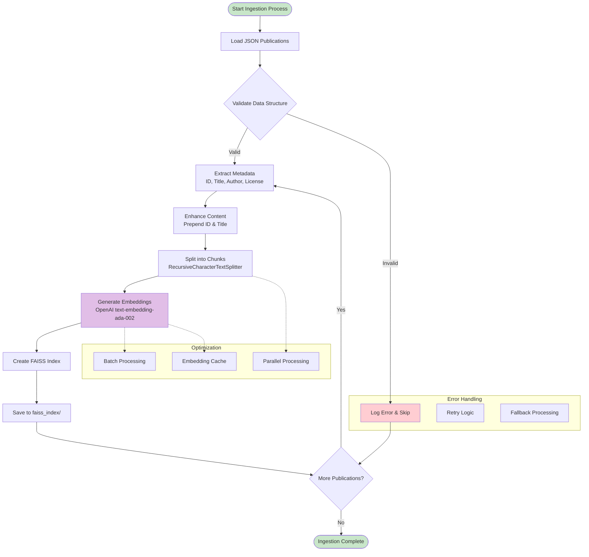

# Data Ingestion Pipeline Flow

```mermaid
flowchart TD
    START([Start Ingestion Process]) --> LOAD[Load JSON Publications]
    LOAD --> VALIDATE{Validate Data Structure}
    VALIDATE -->|Valid| EXTRACT[Extract Metadata<br/>ID, Title, Author, License]
    VALIDATE -->|Invalid| ERROR[Log Error & Skip]
    ERROR --> NEXT{More Publications?}
    
    EXTRACT --> ENHANCE[Enhance Content<br/>Prepend ID & Title]
    ENHANCE --> CHUNK[Split into Chunks<br/>RecursiveCharacterTextSplitter]
    CHUNK --> EMBED[Generate Embeddings<br/>OpenAI text-embedding-ada-002]
    
    EMBED --> STORE[Create FAISS Index]
    STORE --> SAVE[Save to faiss_index/]
    SAVE --> NEXT
    
    NEXT -->|Yes| EXTRACT
    NEXT -->|No| COMPLETE([Ingestion Complete])
    
    subgraph "Error Handling"
        ERROR
        RETRY[Retry Logic]
        FALLBACK[Fallback Processing]
    end
    
    subgraph "Optimization"
        BATCH[Batch Processing]
        CACHE[Embedding Cache]
        PARALLEL[Parallel Processing]
    end
    
    EMBED -.-> BATCH
    EMBED -.-> CACHE
    CHUNK -.-> PARALLEL
    
    style START fill:#c8e6c9
    style COMPLETE fill:#c8e6c9
    style ERROR fill:#ffcdd2
    style EMBED fill:#e1bee7
```
