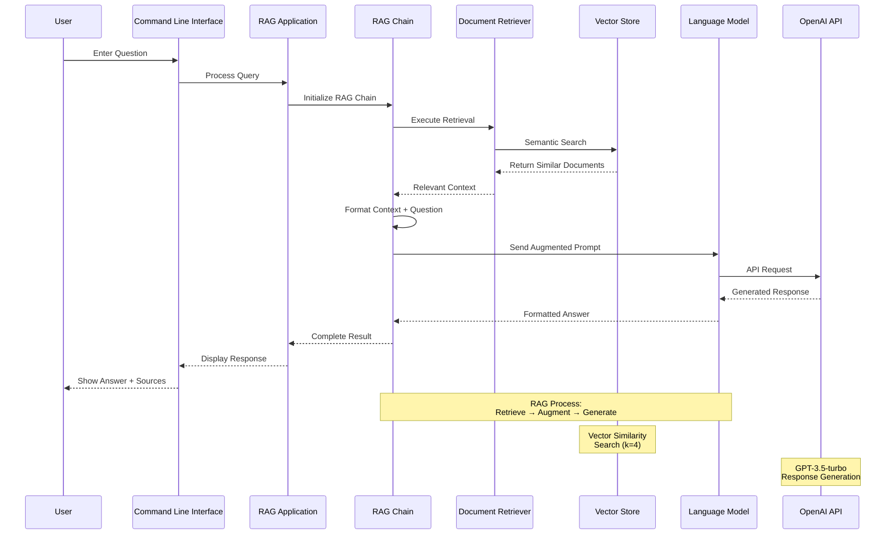

# Question Answering Pipeline

```mermaid
sequenceDiagram
    participant User
    participant CLI as Command Line Interface
    participant App as RAG Application
    participant Chain as RAG Chain
    participant Retriever as Document Retriever
    participant FAISS as Vector Store
    participant LLM as Language Model
    participant OpenAI as OpenAI API
    
    User->>CLI: Enter Question
    CLI->>App: Process Query
    App->>Chain: Initialize RAG Chain
    
    Chain->>Retriever: Execute Retrieval
    Retriever->>FAISS: Semantic Search
    FAISS-->>Retriever: Return Similar Documents
    Retriever-->>Chain: Relevant Context
    
    Chain->>Chain: Format Context + Question
    Chain->>LLM: Send Augmented Prompt
    LLM->>OpenAI: API Request
    OpenAI-->>LLM: Generated Response
    LLM-->>Chain: Formatted Answer
    
    Chain-->>App: Complete Result
    App-->>CLI: Display Response
    CLI-->>User: Show Answer + Sources
    
    Note over Chain, LLM: RAG Process:<br/>Retrieve → Augment → Generate
    Note over FAISS: Vector Similarity<br/>Search (k=4)
    Note over OpenAI: GPT-3.5-turbo<br/>Response Generation
```
