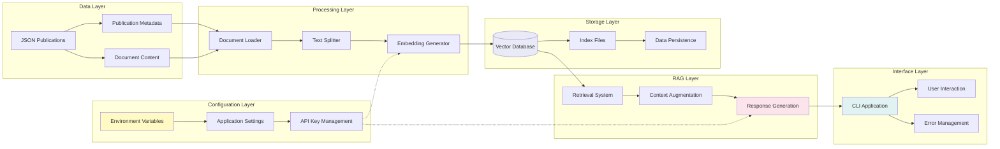

# Component Interaction Diagram

```mermaid
graph LR
    subgraph "Configuration Layer"
        ENV[Environment Variables]
        SETTINGS[Application Settings]
        API_KEYS[API Key Management]
    end
    
    subgraph "Data Layer"
        JSON_DATA[JSON Publications]
        METADATA[Publication Metadata]
        CONTENT[Document Content]
    end
    
    subgraph "Processing Layer"
        LOADER[Document Loader]
        SPLITTER[Text Splitter]
        EMBEDDINGS[Embedding Generator]
    end
    
    subgraph "Storage Layer"
        VECTOR_DB[(Vector Database)]
        INDEX_FILES[Index Files]
        PERSISTENCE[Data Persistence]
    end
    
    subgraph "RAG Layer"
        RETRIEVAL[Retrieval System]
        AUGMENTATION[Context Augmentation]
        GENERATION[Response Generation]
    end
    
    subgraph "Interface Layer"
        CLI_APP[CLI Application]
        USER_IO[User Interaction]
        ERROR_HANDLING[Error Management]
    end
    
    ENV --> SETTINGS
    SETTINGS --> API_KEYS
    
    JSON_DATA --> METADATA
    JSON_DATA --> CONTENT
    
    METADATA --> LOADER
    CONTENT --> LOADER
    LOADER --> SPLITTER
    SPLITTER --> EMBEDDINGS
    
    EMBEDDINGS --> VECTOR_DB
    VECTOR_DB --> INDEX_FILES
    INDEX_FILES --> PERSISTENCE
    
    VECTOR_DB --> RETRIEVAL
    RETRIEVAL --> AUGMENTATION
    AUGMENTATION --> GENERATION
    
    GENERATION --> CLI_APP
    CLI_APP --> USER_IO
    CLI_APP --> ERROR_HANDLING
    
    API_KEYS -.-> EMBEDDINGS
    API_KEYS -.-> GENERATION
    
    style ENV fill:#fff9c4
    style VECTOR_DB fill:#e8eaf6
    style CLI_APP fill:#e0f2f1
    style GENERATION fill:#fce4ec
```
