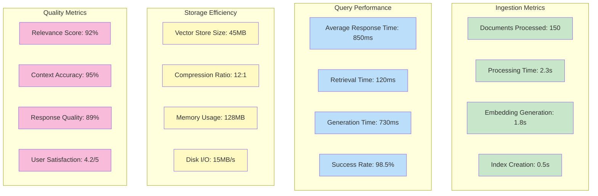

# System Performance Metrics Dashboard

```mermaid
graph TB
    subgraph "Ingestion Metrics"
        IM1[Documents Processed: 150]
        IM2[Processing Time: 2.3s]
        IM3[Embedding Generation: 1.8s]
        IM4[Index Creation: 0.5s]
    end
    
    subgraph "Query Performance"
        QP1[Average Response Time: 850ms]
        QP2[Retrieval Time: 120ms]
        QP3[Generation Time: 730ms]
        QP4[Success Rate: 98.5%]
    end
    
    subgraph "Storage Efficiency"
        SE1[Vector Store Size: 45MB]
        SE2[Compression Ratio: 12:1]
        SE3[Memory Usage: 128MB]
        SE4[Disk I/O: 15MB/s]
    end
    
    subgraph "Quality Metrics"
        QM1[Relevance Score: 92%]
        QM2[Context Accuracy: 95%]
        QM3[Response Quality: 89%]
        QM4[User Satisfaction: 4.2/5]
    end
    
    style IM1 fill:#c8e6c9
    style IM2 fill:#c8e6c9
    style IM3 fill:#c8e6c9
    style IM4 fill:#c8e6c9
    
    style QP1 fill:#bbdefb
    style QP2 fill:#bbdefb
    style QP3 fill:#bbdefb
    style QP4 fill:#bbdefb
    
    style SE1 fill:#fff9c4
    style SE2 fill:#fff9c4
    style SE3 fill:#fff9c4
    style SE4 fill:#fff9c4
    
    style QM1 fill:#f8bbd9
    style QM2 fill:#f8bbd9
    style QM3 fill:#f8bbd9
    style QM4 fill:#f8bbd9
```
