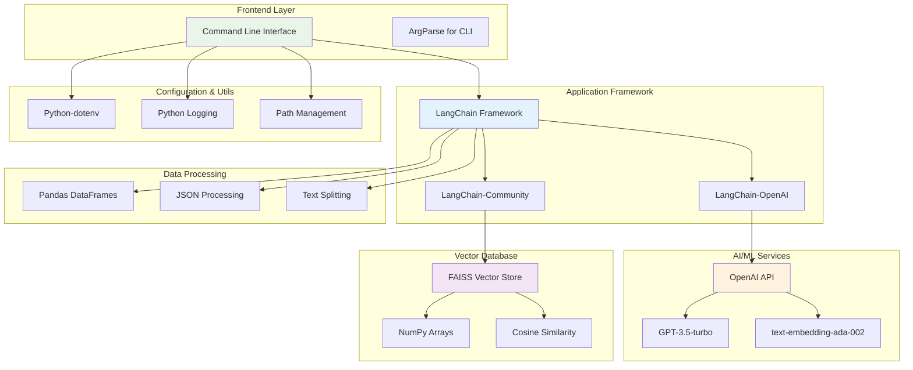

# Technology Stack and Dependencies

```mermaid
graph TD
    subgraph "Frontend Layer"
        CLI[Command Line Interface]
        ARGPARSE[ArgParse for CLI]
    end
    
    subgraph "Application Framework"
        LANGCHAIN[LangChain Framework]
        OPENAI_LANG[LangChain-OpenAI]
        COMMUNITY[LangChain-Community]
    end
    
    subgraph "AI/ML Services"
        OPENAI_API[OpenAI API]
        GPT[GPT-3.5-turbo]
        EMBEDDINGS[text-embedding-ada-002]
    end
    
    subgraph "Vector Database"
        FAISS[FAISS Vector Store]
        NUMPY[NumPy Arrays]
        SIMILARITY[Cosine Similarity]
    end
    
    subgraph "Data Processing"
        PANDAS[Pandas DataFrames]
        JSON_LIB[JSON Processing]
        TEXT_SPLIT[Text Splitting]
    end
    
    subgraph "Configuration & Utils"
        DOTENV[Python-dotenv]
        LOGGING[Python Logging]
        PATHLIB[Path Management]
    end
    
    CLI --> LANGCHAIN
    LANGCHAIN --> OPENAI_LANG
    LANGCHAIN --> COMMUNITY
    
    OPENAI_LANG --> OPENAI_API
    OPENAI_API --> GPT
    OPENAI_API --> EMBEDDINGS
    
    COMMUNITY --> FAISS
    FAISS --> NUMPY
    FAISS --> SIMILARITY
    
    LANGCHAIN --> PANDAS
    LANGCHAIN --> JSON_LIB
    LANGCHAIN --> TEXT_SPLIT
    
    CLI --> DOTENV
    CLI --> LOGGING
    CLI --> PATHLIB
    
    style LANGCHAIN fill:#e3f2fd
    style OPENAI_API fill:#fff3e0
    style FAISS fill:#f3e5f5
    style CLI fill:#e8f5e8
```
