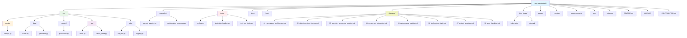

# Project Directory Structure

```mermaid
graph TD
    ROOT[rag_assistant-w1/] --> SRC[src/]
    ROOT --> EXAMPLES[examples/]
    ROOT --> TESTS[tests/]
    ROOT --> DOCS[docs/]
    ROOT --> LOGS[logs/]
    ROOT --> FAISS[faiss_index/]
    ROOT --> DIAGRAMS[diagrams/]
    ROOT --> APP[app.py]
    ROOT --> INGEST[ingest.py]
    ROOT --> REQ[requirements.txt]
    ROOT --> ENV[.env]
    ROOT --> GIT[.gitignore]
    ROOT --> README[README.md]
    ROOT --> LICENSE[LICENSE]
    ROOT --> CONTRIB[CONTRIBUTING.md]
    
    SRC --> CONFIG[config/]
    SRC --> DATA[data/]
    SRC --> MODELS[models/]
    SRC --> RAG[rag/]
    SRC --> UTILS[utils/]
    
    CONFIG --> SETTINGS[settings.py]
    DATA --> LOADER[loader.py]
    DATA --> PROCESSOR[processor.py]
    MODELS --> PUBLICATION[publication.py]
    RAG --> CHAIN[chain.py]
    RAG --> VECTOR[vector_store.py]
    UTILS --> FILE_UTILS[file_utils.py]
    UTILS --> LOGGING_UTILS[logging.py]
    
    EXAMPLES --> SAMPLE[sample_queries.py]
    EXAMPLES --> CONFIG_EX[configuration_examples.py]
    
    TESTS --> CONFTEST[conftest.py]
    TESTS --> TEST_DATA[test_data_loading.py]
    TESTS --> TEST_RAG[test_rag_chain.py]
    
    DIAGRAMS --> ARCH[01_rag_system_architecture.md]
    DIAGRAMS --> INGEST_DIAG[02_data_ingestion_pipeline.md]
    DIAGRAMS --> QA[03_question_answering_pipeline.md]
    DIAGRAMS --> COMP[04_component_interaction.md]
    DIAGRAMS --> PERF[05_performance_metrics.md]
    DIAGRAMS --> TECH[06_technology_stack.md]
    DIAGRAMS --> DIR[07_project_structure.md]
    DIAGRAMS --> ERR[08_error_handling.md]
    
    FAISS --> INDEX[index.faiss]
    FAISS --> PKL[index.pkl]
    
    style ROOT fill:#e1f5fe
    style SRC fill:#e8f5e8
    style CONFIG fill:#fff3e0
    style RAG fill:#f3e5f5
    style TESTS fill:#ffebee
    style DIAGRAMS fill:#f0f4c3
```
