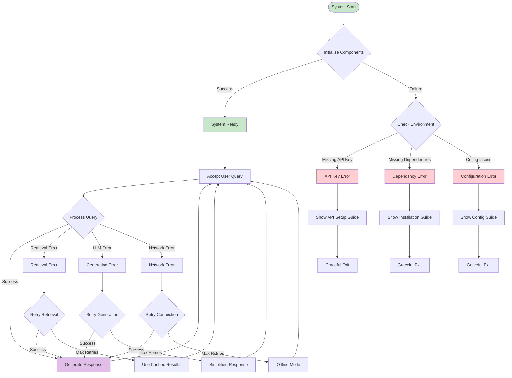

# Error Handling and Recovery Flow

```mermaid
flowchart TD
    START([System Start]) --> INIT{Initialize Components}
    INIT -->|Success| READY[System Ready]
    INIT -->|Failure| CHECK_ENV{Check Environment}
    
    CHECK_ENV -->|Missing API Key| API_ERROR[API Key Error]
    CHECK_ENV -->|Missing Dependencies| DEP_ERROR[Dependency Error]
    CHECK_ENV -->|Config Issues| CONFIG_ERROR[Configuration Error]
    
    API_ERROR --> GUIDE1[Show API Setup Guide]
    DEP_ERROR --> GUIDE2[Show Installation Guide]
    CONFIG_ERROR --> GUIDE3[Show Config Guide]
    
    READY --> QUERY_INPUT[Accept User Query]
    QUERY_INPUT --> PROCESS{Process Query}
    
    PROCESS -->|Success| RESPONSE[Generate Response]
    PROCESS -->|Retrieval Error| RET_ERROR[Retrieval Error]
    PROCESS -->|LLM Error| LLM_ERROR[Generation Error]
    PROCESS -->|Network Error| NET_ERROR[Network Error]
    
    RET_ERROR --> RETRY1{Retry Retrieval}
    LLM_ERROR --> RETRY2{Retry Generation}
    NET_ERROR --> RETRY3{Retry Connection}
    
    RETRY1 -->|Success| RESPONSE
    RETRY1 -->|Max Retries| FALLBACK1[Use Cached Results]
    
    RETRY2 -->|Success| RESPONSE
    RETRY2 -->|Max Retries| FALLBACK2[Simplified Response]
    
    RETRY3 -->|Success| RESPONSE
    RETRY3 -->|Max Retries| FALLBACK3[Offline Mode]
    
    RESPONSE --> QUERY_INPUT
    FALLBACK1 --> QUERY_INPUT
    FALLBACK2 --> QUERY_INPUT
    FALLBACK3 --> QUERY_INPUT
    
    GUIDE1 --> EXIT1[Graceful Exit]
    GUIDE2 --> EXIT2[Graceful Exit]
    GUIDE3 --> EXIT3[Graceful Exit]
    
    style START fill:#c8e6c9
    style READY fill:#c8e6c9
    style API_ERROR fill:#ffcdd2
    style DEP_ERROR fill:#ffcdd2
    style CONFIG_ERROR fill:#ffcdd2
    style RESPONSE fill:#e1bee7
```
